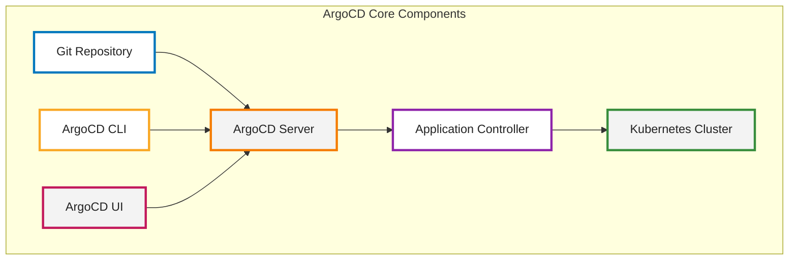
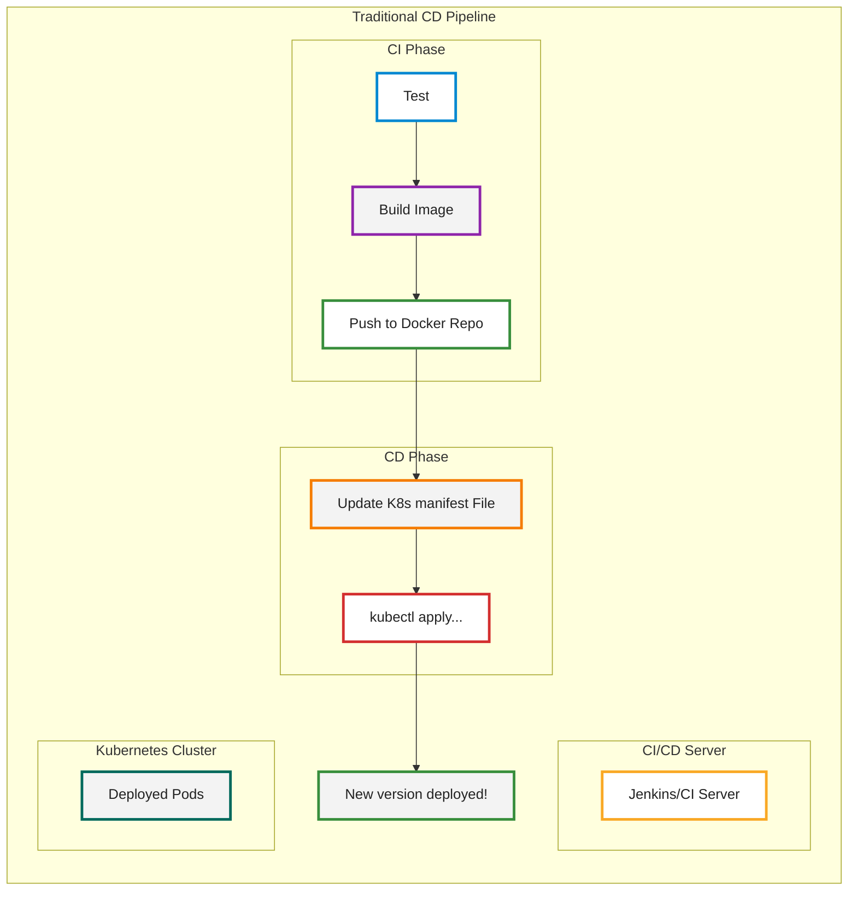
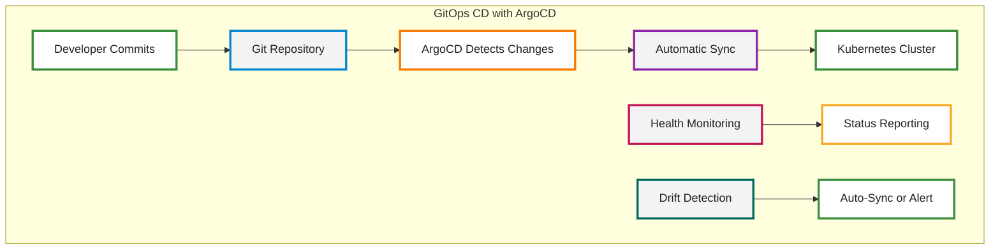
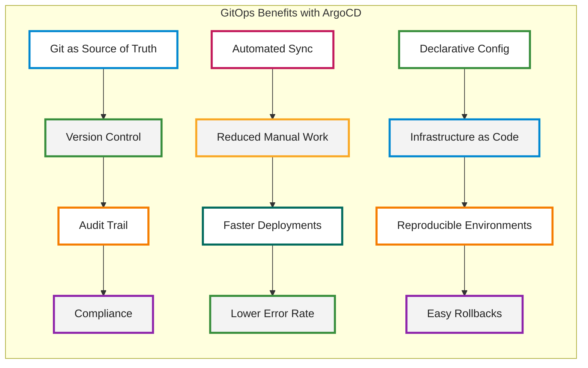
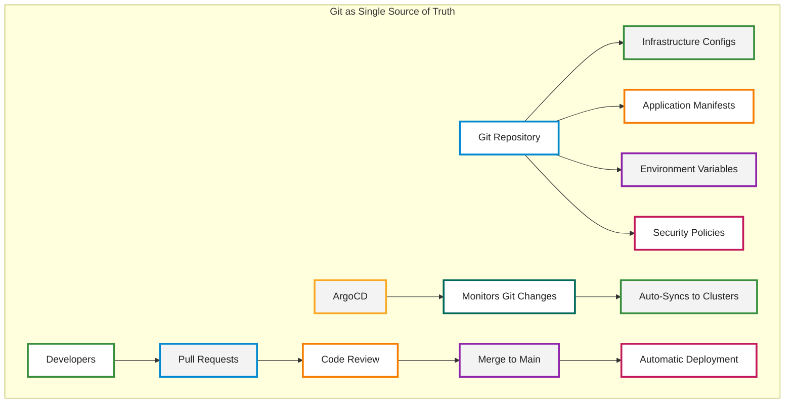
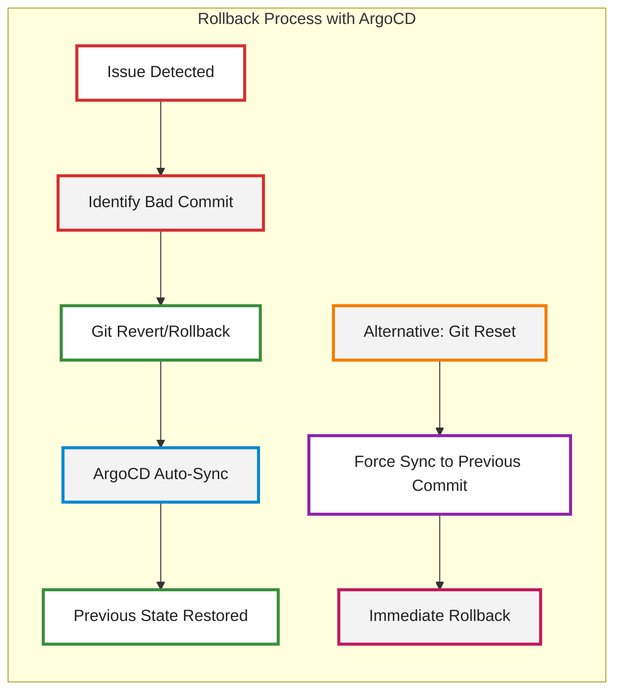
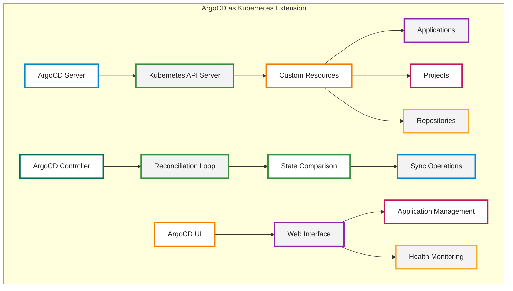

# ArgoCD Documentation: GitOps Continuous Deployment

## Table of Contents
1. [What is ArgoCD](#what-is-argocd)
2. [CD Workflow without ArgoCD](#cd-workflow-without-argocd)
3. [CD Workflow with ArgoCD](#cd-workflow-with-argocd)
4. [Benefits of using GitOps with ArgoCD](#benefits-of-using-gitops-with-argocd)
5. [Git as Single Source of Truth](#git-as-single-source-of-truth)
6. [Easy Rollback](#easy-rollback)
7. [Cluster Disaster Recovery](#cluster-disaster-recovery)
8. [ArgoCD as Kubernetes Extension](#argocd-as-kubernetes-extension)
9. [How to configure ArgoCD](#how-to-configure-argocd)
10. [ArgoCD vs Other GitOps Tools](#argocd-vs-other-gitops-tools)

---

## What is ArgoCD

**ArgoCD** is a declarative, GitOps continuous delivery tool for Kubernetes. It follows the GitOps pattern where Git repositories are considered the source of truth for defining the desired applicatio[...]



---

## CD Workflow without ArgoCD

Traditional continuous deployment workflows often involve multiple manual steps, complex pipelines, and potential human errors.



### Problems with Traditional CD:
- **Manual interventions** leading to human errors
- **Configuration drift** between environments
- **Difficult rollbacks** and recovery
- **Lack of audit trail** for deployments
- **Environment inconsistencies**

---

## CD Workflow with ArgoCD

ArgoCD implements GitOps principles, creating a more reliable and automated deployment process.



### Benefits of ArgoCD Workflow:
- **Automated deployments** triggered by Git changes
- **Declarative configuration** management
- **Real-time health monitoring** and status reporting
- **Automatic drift detection** and reconciliation
- **Audit trail** for all changes

---

## Benefits of using GitOps with ArgoCD

GitOps with ArgoCD provides numerous advantages for modern application deployment and management.



### Key Benefits:
1. **Improved Security**: All changes go through Git review process
2. **Better Compliance**: Complete audit trail of all deployments
3. **Faster Recovery**: Quick rollback to previous known good state
4. **Team Collaboration**: Multiple developers can review and approve changes
5. **Environment Consistency**: Same configuration across all environments

---

## Git as Single Source of Truth

In GitOps, Git repositories become the authoritative source for all infrastructure and application configurations.



### Advantages:
- **Centralized Configuration Management**
- **Version Control for Infrastructure**
- **Branch-based Environment Management**
- **Pull Request Workflows**
- **Automated Deployment Triggers**

---

## Easy Rollback

ArgoCD makes rollbacks simple and reliable by leveraging Git's version control capabilities.



### Rollback Methods:
1. **Git Revert**: Create new commit that undoes changes
2. **Git Reset**: Move HEAD to previous commit
3. **Manual Sync**: Force ArgoCD to sync to specific commit
4. **Branch Switch**: Deploy from different Git branch

### Benefits:
- **Instant Rollback** to any previous state
- **No Manual Intervention** required
- **Audit Trail** maintained
- **Multiple Rollback Strategies** available

---

## Cluster Disaster Recovery

ArgoCD simplifies disaster recovery by maintaining cluster state in Git repositories.

```mermaid
---
theme: "base"
themeVariables:
  primaryColor: "#ffffff"
  secondaryColor: "#f3f3f3"
  edgeLabelBackground: "#ffffff"
  fontSize: "16px"
  textColor: "#222222"
---
graph TB
    subgraph "Disaster Recovery with ArgoCD"
        A[Cluster Failure] --> B[Assess Damage]
        B --> C[Create New Cluster]
        C --> D[Install ArgoCD]
        D --> E[Point to Git Repo]
        E --> F[Auto-Sync Applications]
        F --> G[Cluster Restored]
        H[Backup Strategy] --> I[Git Repository Backup]
        I --> J[Off-site Storage]
        J --> K[Recovery Testing]
        style A fill:#ffffff,stroke:#d32f2f,stroke-width:3px,color:#222
        style B fill:#f3f3f3,stroke:#d32f2f,stroke-width:3px,color:#222
        style C fill:#ffffff,stroke:#388e3c,stroke-width:3px,color:#222
        style D fill:#f3f3f3,stroke:#0288d1,stroke-width:3px,color:#222
        style E fill:#ffffff,stroke:#f57c00,stroke-width:3px,color:#222
        style F fill:#f3f3f3,stroke:#8e24aa,stroke-width:3px,color:#222
        style G fill:#ffffff,stroke:#388e3c,stroke-width:3px,color:#222
        style H fill:#f3f3f3,stroke:#c2185b,stroke-width:3px,color:#222
        style I fill:#ffffff,stroke:#f9a825,stroke-width:3px,color:#222
        style J fill:#f3f3f3,stroke:#00695c,stroke-width:3px,color:#222
        style K fill:#ffffff,stroke:#388e3c,stroke-width:3px,color:#222
    end
```



### Recovery Process:
1. **Infrastructure Provisioning**: Create new cluster
2. **ArgoCD Installation**: Deploy ArgoCD to new cluster
3. **Repository Connection**: Point ArgoCD to Git repository
4. **Automatic Sync**: Applications deploy automatically
5. **State Verification**: Confirm all applications are running

### Advantages:
- **Rapid Recovery**: Minutes instead of hours/days
- **Consistent State**: Exact replica of previous cluster
- **No Data Loss**: All configurations preserved in Git
- **Automated Process**: Minimal manual intervention

---

## ArgoCD vs Other GitOps Tools

A comprehensive comparison of ArgoCD with other popular GitOps and CD tools in the market.

### Tool Comparison Table

| Feature | ArgoCD | Flux | Spinnaker | Jenkins X |
|---------|--------|------|-----------|-----------|
| **Architecture** | Kubernetes-native, CRD-based | Kubernetes-native, GitOps-first | Multi-cloud, Netflix OSS | Jenkins-based, GitOps-enabled |
| **Installation** | Single namespace deployment | Helm chart or operator | Complex multi-component | Jenkins + plugins |
| **Learning Curve** | Low to Medium | Low | High | Medium to High |
| **Multi-Cluster** | ✅ Excellent | ✅ Good | ✅ Excellent | ⚠️ Limited |
| **GitOps Support** | ✅ Native | ✅ Native | ⚠️ Partial | ✅ Good |
| **Kubernetes Integration** | ✅ Deep | ✅ Deep | ⚠️ Basic | ✅ Good |
| **Web UI** | ✅ Rich & Intuitive | ❌ CLI-focused | ✅ Complex but Powerful | ⚠️ Jenkins-based |
| **CLI Support** | ✅ Excellent | ✅ Excellent | ✅ Good | ✅ Good |
| **Community** | ✅ Large & Active | ✅ Growing | ✅ Established | ✅ Large |
| **Enterprise Features** | ✅ Available | ⚠️ Limited | ✅ Rich | ✅ Available |
| **Performance** | ✅ Fast | ✅ Very Fast | ⚠️ Resource-heavy | ⚠️ Can be slow |
| **Security** | ✅ RBAC, SSO | ✅ RBAC | ✅ Multi-cloud security | ✅ Jenkins security |

### Detailed Comparison

#### ArgoCD vs Flux
- **ArgoCD**: Better UI, more features, enterprise support
- **Flux**: Lighter weight, faster, simpler architecture

#### ArgoCD vs Spinnaker
- **ArgoCD**: Kubernetes-focused, GitOps-native, simpler
- **Spinnaker**: Multi-cloud, complex pipelines, Netflix heritage

#### ArgoCD vs Jenkins X
- **ArgoCD**: GitOps-first, Kubernetes-native, modern
- **Jenkins X**: Jenkins-based, familiar for Jenkins users, more CI features

### When to Choose ArgoCD
- **Kubernetes-first environments**
- **GitOps workflows**
- **Multi-cluster management**
- **Enterprise requirements**
- **Rich UI requirements**

### When to Choose Alternatives
- **Flux**: Lightweight, simple GitOps needs
- **Spinnaker**: Complex multi-cloud pipelines
- **Jenkins X**: Jenkins-based CI/CD workflows

---

## ArgoCD as Kubernetes Extension

ArgoCD is designed as a native Kubernetes extension, leveraging Kubernetes APIs and resources.



### Kubernetes Integration:
- **Custom Resources**: Applications, Projects, Repositories
- **API Extensions**: Extends Kubernetes API
- **Operator Pattern**: Follows Kubernetes operator design
- **Resource Management**: Manages Kubernetes resources declaratively

### Architecture Benefits:
- **Native Integration**: Seamless Kubernetes experience
- **Resource Efficiency**: Leverages existing Kubernetes infrastructure
- **Scalability**: Scales with Kubernetes cluster
- **Security**: Inherits Kubernetes security model

---

## How to configure ArgoCD?

Setting up ArgoCD involves several configuration steps for a production-ready deployment.

```mermaid
---
theme: "base"
themeVariables:
  primaryColor: "#ffffff"
  secondaryColor: "#f3f3f3"
  edgeLabelBackground: "#ffffff"
  fontSize: "16px"
  textColor: "#222222"
---
graph TB
    subgraph "ArgoCD Configuration Steps"
        A[Install ArgoCD] --> B[Configure RBAC]
        B --> C[Set up Repositories]
        C --> D[Create Projects]
        D --> E[Define Applications]
        E --> F[Configure Sync Policies]
        F --> G[Set up Notifications]
        H[Security Config] --> I[SSO Integration]
        I --> J[Network Policies]
        J --> K[Resource Limits]
        style A fill:#ffffff,stroke:#388e3c,stroke-width:3px,color:#222
        style B fill:#f3f3f3,stroke:#0288d1,stroke-width:3px,color:#222
        style C fill:#ffffff,stroke:#f57c00,stroke-width:3px,color:#222
        style D fill:#f3f3f3,stroke:#8e24aa,stroke-width:3px,color:#222
        style E fill:#ffffff,stroke:#c2185b,stroke-width:3px,color:#222
        style F fill:#f3f3f3,stroke:#f9a825,stroke-width:3px,color:#222
        style G fill:#ffffff,stroke:#00695c,stroke-width:3px,color:#222
        style H fill:#f3f3f3,stroke:#388e3c,stroke-width:3px,color:#222
        style I fill:#ffffff,stroke:#388e3c,stroke-width:3px,color:#222
        style J fill:#f3f3f3,stroke:#0288d1,stroke-width:3px,color:#222
        style K fill:#ffffff,stroke:#f57c00,stroke-width:3px,color:#222
    end
```



### Configuration Steps:

#### 1. Installation
```bash
# Install ArgoCD
kubectl create namespace argocd
kubectl apply -n argocd -f https://raw.githubusercontent.com/argoproj/argo-cd/stable/manifests/install.yaml
```

#### 2. RBAC Configuration
```yaml
apiVersion: v1
kind: ConfigMap
metadata:
  name: argocd-rbac-cm
  namespace: argocd
data:
  policy.default: role:readonly
  policy.csv: |
    p, role:org-admin, applications, *, */*, allow
    p, role:org-admin, clusters, *, *, allow
    p, role:org-admin, repositories, *, *, allow
```

#### 3. Repository Configuration
```yaml
apiVersion: v1
kind: Secret
metadata:
  name: private-repo
  namespace: argocd
  labels:
    argocd.argoproj.io/secret-type: repository
stringData:
  type: git
  url: https://github.com/username/repo
  username: username
  password: password
```

#### 4. Application Definition
```yaml
apiVersion: argoproj.io/v1alpha1
kind: Application
metadata:
  name: sample-app
  namespace: argocd
spec:
  project: default
  source:
    repoURL: https://github.com/username/repo
    targetRevision: HEAD
    path: k8s
  destination:
    server: https://kubernetes.default.svc
    namespace: default
  syncPolicy:
    automated:
      prune: true
      selfHeal: true
```

---


---


---

## Conclusion

ArgoCD represents a paradigm shift in how we approach continuous deployment in Kubernetes environments. By embracing GitOps principles, it provides:

- **Reliability**: Automated, consistent deployments
- **Security**: Git-based access control and audit trails
- **Scalability**: Multi-cluster management capabilities
- **Simplicity**: Declarative configuration management
- **Recovery**: Easy rollbacks and disaster recovery

The combination of Git as the single source of truth and ArgoCD as the deployment controller creates a robust, auditable, and maintainable deployment pipeline that scales with modern application archi[...]

---

## Additional Resources

- [ArgoCD Official Documentation](https://argo-cd.readthedocs.io/)
- [GitOps Best Practices](https://www.gitops.tech/)
- [Kubernetes GitOps Patterns](https://kubernetes.io/docs/concepts/workloads/controllers/)
- [ArgoCD GitHub Repository](https://github.com/argoproj/argo-cd)
