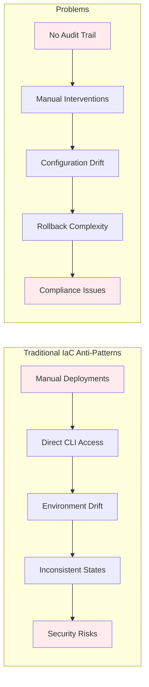
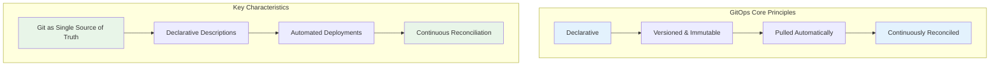
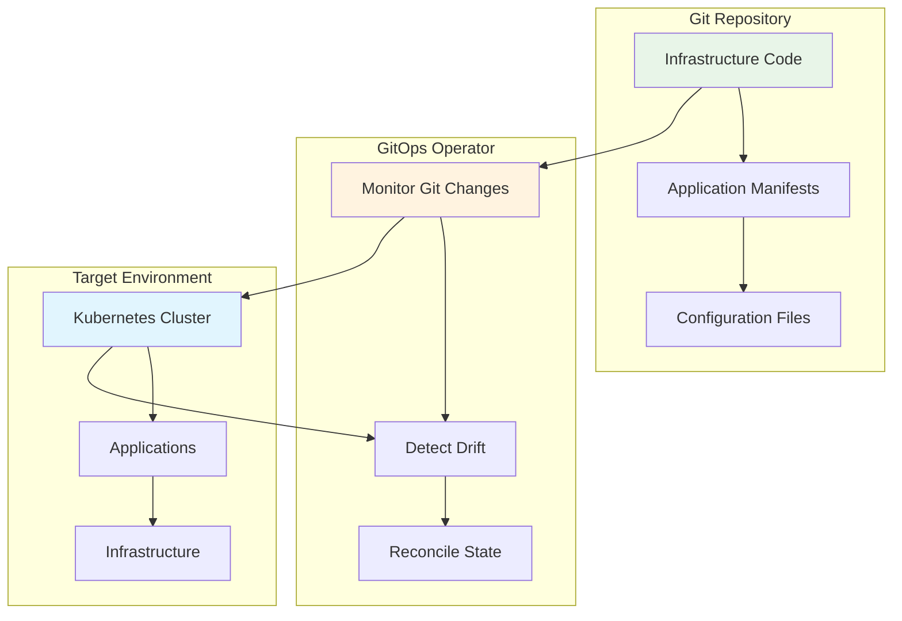
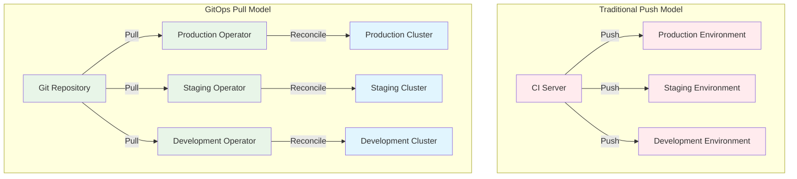
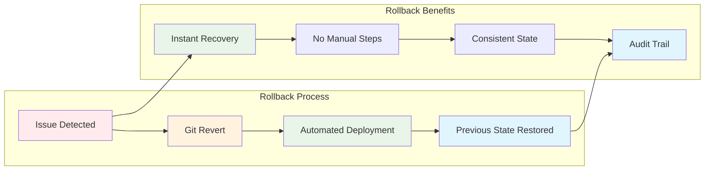
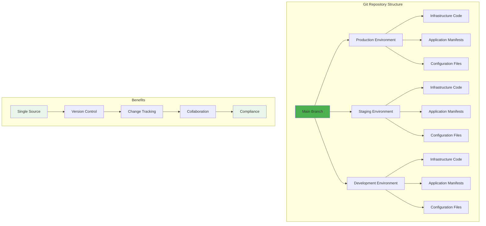
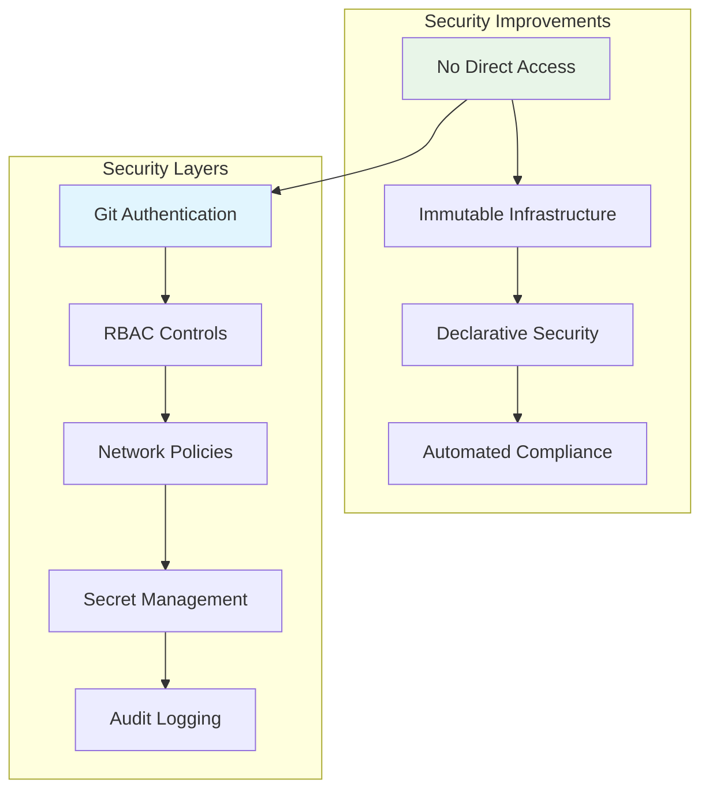

# GitOps: Revolutionizing DevOps with Git as the Single Source of Truth

## Table of Contents
1. [Introduction](#introduction)
2. [Infrastructure as Code - X as Code](#infrastructure-as-code---x-as-code)
3. [Using IaC the Wrong Way](#using-iac-the-wrong-way)
4. [What is GitOps?](#what-is-gitops)
5. [How GitOps Works?](#how-gitops-works)
6. [CD Pipeline: Push vs Pull Model](#cd-pipeline-push-vs-pull-model)
7. [Easy Rollback](#easy-rollback)
8. [Git - Single Source of Truth](#git---single-source-of-truth)
9. [Increasing Security](#increasing-security)

---

## Introduction

GitOps is a modern approach to continuous deployment that leverages Git as the single source of truth for declarative infrastructure and applications. It represents a paradigm shift from traditional CI/CD pipelines to a Git-centric workflow that ensures consistency, traceability, and reliability across all environments.

**Key Benefits:**
- 🚀 **Faster Deployments** - Automated deployments triggered by Git changes
- 🔒 **Enhanced Security** - Immutable infrastructure with audit trails
- 📊 **Better Visibility** - Complete transparency of deployment states
- 🔄 **Easy Rollbacks** - Quick recovery to previous stable states
- 🎯 **Consistency** - Same deployment process across all environments

---

## Infrastructure as Code - X as Code

The "X as Code" movement represents the evolution of treating various IT resources as code that can be versioned, tested, and deployed automatically.

```mermaid
graph TB
    subgraph "X as Code Evolution"
        A[Infrastructure as Code] --> B[Configuration as Code]
        B --> C[Security as Code]
        C --> D[Policy as Code]
        D --> E[Documentation as Code]
        E --> F[Everything as Code]
    end
    
    subgraph "Benefits"
        G[Version Control] --> H[Automation]
        H --> I[Consistency]
        I --> J[Reproducibility]
        J --> K[Collaboration]
    end
    
    style A fill:#e1f5fe
    style F fill:#4caf50
    style G fill:#fff3e0
    style K fill:#e8f5e8
```



**Core Principles:**
- **Declarative**: Define what you want, not how to get it
- **Versioned**: All changes tracked in Git
- **Automated**: Deployments happen automatically
- **Testable**: Infrastructure can be validated before deployment
- **Reproducible**: Same result every time

---

## Using IaC the Wrong Way

Many organizations implement Infrastructure as Code but still follow traditional deployment patterns, missing the full benefits of GitOps.



**Common Anti-Patterns:**
- ❌ **Manual deployments** outside of Git workflow
- ❌ **Direct access** to production environments
- ❌ **Environment drift** from declared state
- ❌ **No rollback strategy** for failed deployments
- ❌ **Lack of audit trails** for changes

---

## What is GitOps?

GitOps is an operational framework that takes DevOps best practices used for application development and applies them to infrastructure automation. It uses Git as the single source of truth for declarative infrastructure and applications.



**GitOps Definition:**
> "GitOps is a way to do Kubernetes cluster management and application delivery. GitOps works by using Git as a single source of truth for declarative infrastructure and applications."

---

## How GitOps Works?

GitOps operates on a continuous reconciliation model where the desired state in Git is automatically synchronized with the actual state in the target environment.



**Workflow Steps:**
1. **Developers** commit changes to Git repository
2. **GitOps Operator** detects changes automatically
3. **Reconciliation** compares desired vs actual state
4. **Deployment** applies changes to target environment
5. **Verification** ensures successful deployment
6. **Monitoring** continues to watch for drift

---

## CD Pipeline: Push vs Pull Model

GitOps introduces a fundamental shift from traditional push-based deployments to a pull-based model that enhances security and reliability.



**Push vs Pull Comparison:**

| Aspect | Push Model | Pull Model (GitOps) |
|--------|------------|---------------------|
| **Security** | CI/CD has production access | No direct production access |
| **Reliability** | Single point of failure | Distributed, resilient |
| **Audit Trail** | Limited visibility | Complete Git history |
| **Rollback** | Complex, manual | Simple, automated |
| **Consistency** | Prone to drift | Continuous reconciliation |

---

## Easy Rollback

One of the most powerful features of GitOps is the ability to quickly and safely rollback to any previous state by simply reverting Git commits.



**Rollback Scenarios:**
- 🚨 **Production Issues** - Quick recovery from failed deployments
- 🐛 **Bug Introductions** - Revert to last working version
- 🔧 **Configuration Errors** - Return to stable configuration
- 📊 **Performance Degradation** - Rollback to optimized version

**Rollback Commands:**
```bash
# Simple Git revert
git revert HEAD
git push origin main

# Rollback to specific commit
git revert <commit-hash>
git push origin main
```

---

## Git - Single Source of Truth

Git becomes the authoritative source for all infrastructure and application configurations, ensuring consistency and traceability across all environments.



**Single Source of Truth Advantages:**
- 🔍 **Complete Visibility** - All changes tracked in one place
- 📝 **Audit Trail** - Full history of who changed what and when
- 🤝 **Team Collaboration** - Multiple teams work from same source
- ✅ **Compliance** - Easy to demonstrate change management
- 🔄 **Consistency** - Same configuration across all environments

---

## Increasing Security

GitOps significantly enhances security by implementing the principle of least privilege and eliminating direct access to production environments.



**Security Enhancements:**

| Security Aspect | Traditional Approach | GitOps Approach |
|-----------------|---------------------|-----------------|
| **Access Control** | Direct SSH/CLI access | Git-based changes only |
| **Change Management** | Manual interventions | Automated, audited |
| **Secret Management** | Hardcoded in scripts | External secret stores |
| **Compliance** | Manual documentation | Automated audit trails |
| **Network Security** | Broad access policies | Principle of least privilege |

**Security Best Practices:**
- 🔐 **Git Signing** - GPG key verification for commits
- 🚫 **Branch Protection** - Prevent direct pushes to main
- 👥 **Code Reviews** - Mandatory PR reviews
- 🔍 **Automated Scanning** - Security and compliance checks
- 📊 **Continuous Monitoring** - Real-time security alerts

---

## Next Steps: ArgoCD Deep Dive

In the following sections, we will explore ArgoCD, a powerful GitOps continuous delivery tool for Kubernetes that implements all the principles discussed above.

**ArgoCD Topics to Cover:**
- 🚀 **ArgoCD Architecture** - Understanding the core components
- ⚙️ **Installation & Setup** - Getting started with ArgoCD
- 🔧 **Configuration** - Setting up applications and projects
- 📊 **Monitoring & Observability** - Tracking deployment health
- 🛡️ **Security Features** - RBAC, SSO, and compliance
- 🔄 **Advanced Workflows** - Multi-cluster and multi-environment setups

---

*This document provides a comprehensive foundation for understanding GitOps principles and practices. The next section will dive deep into ArgoCD implementation and practical usage.*
